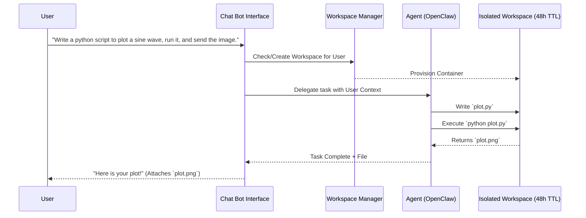
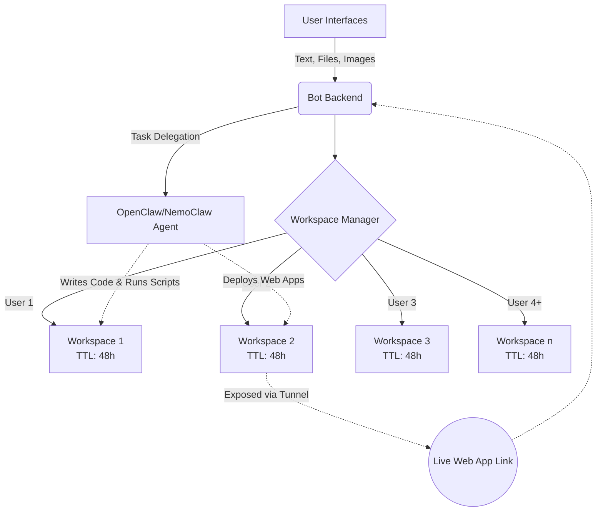

# Project 1: A Bot with Big Claw

## Problem Statement
Build an advanced, multimodal Telegram/Discord chatbot that acts as an autonomous developer assistant. The bot must:
1. **Maintain context-aware conversations** with users.
2. Provision a **48-hour isolated workspace (VM/container)** for each user.
3. Use **agentic frameworks (OpenClaw/NemoClaw)** to autonomously write code, manage files, and execute scripts inside the user's workspace.
4. **Deploy web applications** on the fly and return live links or generated files directly to the chat.
5. Reliably and safely handle at least **4 simultaneous users**.

## Architecture & Flow

### 1. Task Execution Flow

### 2. System Architecture

## Example Input / Output
- **User Input:** "Create a React app with a dark mode toggle, run it, and give me the link."
- **Bot Action:** 
  1. Creates the React app in the user's VM.
  2. Edits code to implement the dark mode logic.
  3. Runs the dev server (`npm run dev`).
  4. Exposes the local port via a tunnel (e.g., Ngrok, Cloudflare).
- **Bot Output:** "App deployed! Access it here: `https://dark-mode-xyz.trycloudflare.com`"

## Evaluation Criteria (Student Deliverables)
1. **Source Code**: Complete bot logic, agent integration, and containerized workspace management logic.
2. **Setup Instructions**: Detailed `README.md` and `.env.example` file.
3. **Concurrency Proof**: Clear implementation showing how 4+ parallel user sessions are isolated and handled (e.g., async, multi-threading).
4. **Demo Video**: A 2-3 minute video demonstrating:
   - History/context awareness.
   - File generation and returning the file to chat.
   - A live web application deployment with a working URL.
   - Multiple users interacting simultaneously without collision.
