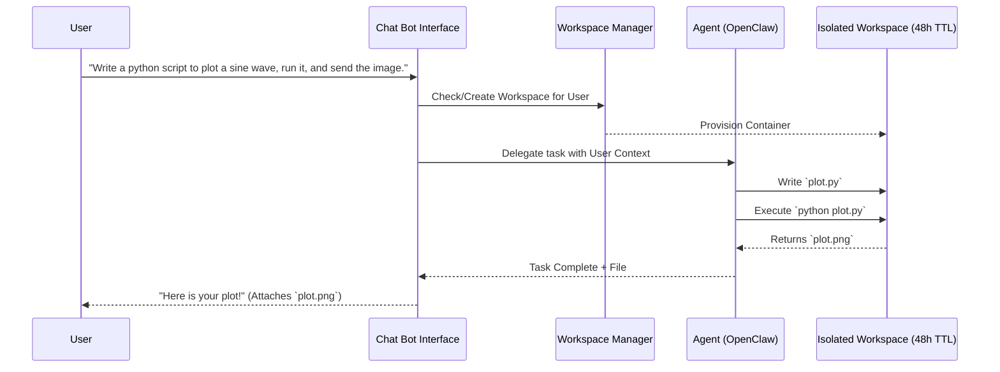
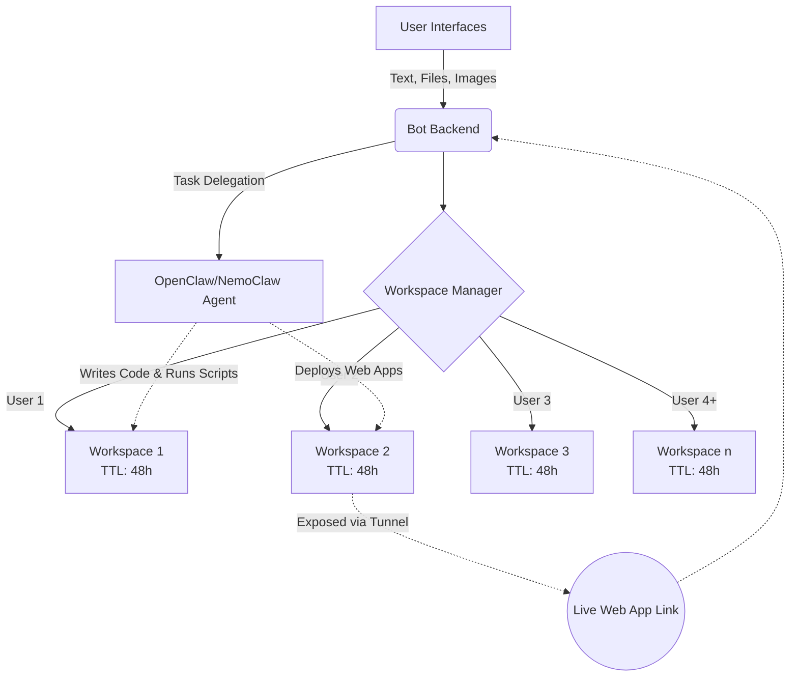

# Project 1: A Bot with Big Claw

## Problem Statement
Build an advanced, multimodal Telegram/Discord chatbot that acts as an autonomous developer assistant. The bot must:
1. **Maintain context-aware conversations** with users.
2. Provision a **48-hour isolated workspace (VM/container)** for each user.
3. Use **agentic frameworks (OpenClaw/NemoClaw)** to autonomously write code, manage files, and execute scripts inside the user's workspace.
4. **Deploy web applications** on the fly and return live links or generated files directly to the chat.
5. Reliably and safely handle at least **4 simultaneous users**.

## Architecture & Flow

### 1. Task Execution Flow

### 2. System Architecture

## Example-1Input / Output
- **User Input:** "Create a React app with a dark mode toggle, run it, and give me the link."
- **Bot Action:** 
  1. Creates the React app in the user's VM.
  2. Edits code to implement the dark mode logic.
  3. Runs the dev server (`npm run dev`).
  4. Exposes the local port via a tunnel (e.g., Ngrok, Cloudflare).
- **Bot Output:** "App deployed! Access it here: `https://dark-mode-xyz.trycloudflare.com`"

## Example-2 Input / Output
   - **User Input:** "Write a python script to scrape top 10 trending news from DD news and organize and summarize and give me in html format."
- **Bot Action:**
  1. Creates the python script in the user's VM.
  2. Runs the python script.
  3. Create the html file
- **Bot Output:** "Here is the html file with the summaries of top 10 trending news from DD news!" *(Attaches `news.html`)*
- **User Input:** "Create a blog post on the 2nd news that you have given and give me in form of a markdown file and an image showing the effect of 2nd news"
- **Bot Action:**
  1. Reads the content of the 2nd news.
  2. Creates the blog post in form of markdown file.
  3. Create an image file showing the effect of 2nd news.
- **Bot Output:** "Here is the blog post content & the image *(Attaches `blog.md` & `image.png`)*